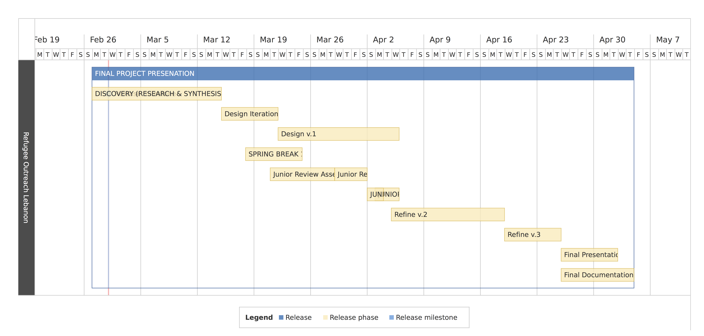

# Designing Services for Syrian Refugees

Hello, this is a team project created by [Nathaniel Smith](http://nathanielsmith.io), [Andres Hurtado](https://www.andreshurtadodesign.com/), [Jennifer Kim](http://kim-jennifer.squarespace.com/about/), and [Weiwei Hsu](http://www.weiweihsu.com/#/) in Undergraduate Interaction Design 4: Experience.

## Overview
An estimate of 1 million Syrians are physically injured, and roughly 80,000 need prosthetic fittings to replace limbs lost to the war.

In the Interaction Design Department at California College of the Arts, we are exploring the growing refugee crisis and how products and services might be designed and leveraged for the continued migration of millions of people.

We are in the process of creating a universal training protocol for prosthetics fitting, with thorough considerations on the limitations refugees might have.

* See our plan, timeline, resources on [Dropbox Paper](https://paper.dropbox.com/doc/Syrian-Refugee-FAULwhXWjvTNnYETJrq2x).
* To submit an issue or a task from your phone via IFTTT, use this [Applet](https://ifttt.com/applets/197941p)

## Secondary Research

* See [Information on Syrian Refugee](http://www.weiweihsu.com/syrianrefugee/info.html) for a collection of our secondary research
* See [Research on Syrian Refuge](http://www.weiweihsu.com/syrianrefugee/synthesis.html) to view the synthesis of our primary and secondary research
* To contribute to the directory please:
  * Open a new issue in the **issues** tab of this Github repository
  * Put title of the link in the title of the issue: **rsrch: xxx.pdf** or **rsrch:xxx.html**

## Progress

* See the **issues** tab of this repository for our past and current to-dos
* Under the **issues** tab, click on **milestones** to see our milestones and deadlines for this project
* See the **projects** tab to look at the visualized to-dos
* This is the roadmap of the project

## Documenation

* To avoid having a design project being created behind the curtain, a [website](http://www.weiweihsu.com/syrianrefugee/) has been created to document our process and Progress
* Since the process will generate ideas on several potential final prototypes, we would like to document other design opportunities that we didn't pursue, and support those opportunities with evidence through documentation

* Subscribe to our Apple Calendar by copying and pasting the link below into a new browser tab (Warning: when you click on it you **will** subscribe to it immediately)

webcal://p22-calendars.icloud.com/published/2/VRIcl6CvQ4Q2b1vOBfHF4W0P6UADFqbnrqilJbSxS0eR0q3uz7mJdt2iMfesQSOddpke8A2hWjb9Lwl8DEQITM1VOqg15wl7_ez4oR1-hug
